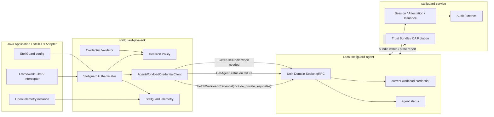

# StellGuard Java SDK 架构设计

## 1. 问题分析

`stellguard-java-sdk` 是 StellGuard 在 JVM 生态中的核心客户端。它不直接访问 `stellguard-service`，也不承担证书签发、节点认证、CA 轮换或策略管理职责；这些能力由 `stellguard-agent` 和 `stellguard-service` 完成。SDK 的边界是连接本机 `stellguard-agent` 暴露的 Unix Domain Socket gRPC API，并向 Java 应用提供一个稳定的认证客户端。

上游职责划分如下：

- `stellguard-service` 是零信任身份控制面，负责 agent session、node attestation、policy binding、workload certificate issuance、trust bundle、CA key rotation 和 audit events。
- `stellguard-agent` 是节点侧 agent，负责与 service 建立可信控制面连接，拉取和轮换 workload 凭据，并通过本机 UDS gRPC API 暴露 `FetchWorkloadCredential`、`WatchWorkloadCredential`、`GetTrustBundle` 和 `GetAgentStatus`。
- `stellguard-java-sdk` 只面向本机 agent，不持有 service bootstrap token，不直接申请证书，不代理业务流量。
- `stellflux` 后续作为框架集成层，负责把 Spring Boot、Web Filter、Gateway、RPC 拦截器、配置中心和 OpenTelemetry 实例传入 SDK。

当前 SDK 要解决的核心问题不是“如何签发证书”，而是“如何把 agent 的本地身份结果转换成业务可消费的认证决策”：

- 当 agent 返回可用 workload credential，并且 SDK 本地校验通过时，认证成功。
- 当 agent 正常工作并明确拒绝当前 workload 或 audience 时，认证失败，默认拦截。
- 当认证失败是 agent 故障、agent 未就绪、UDS 不可达、响应超时或本地凭据不可用导致时，默认放行，避免 agent 故障扩大为业务不可用。
- 当业务希望在灰度、旁路或治理观察阶段先不拦截 agent 正常拒绝时，可以通过配置将“正常认证失败”也改为放行。
- OpenTelemetry 由框架侧传入 SDK；SDK 只记录指标，不负责创建 exporter、reader、collector endpoint 或全局 SDK。

参考契约：

- Agent workload API: <https://github.com/stellhub/stellguard-agent/blob/main/proto/stellguard/agent/v1/workload.proto>
- StellGuard Agent: <https://github.com/stellhub/stellguard-agent>
- StellGuard Service: <https://github.com/stellhub/stellguard-service>

## 2. 设计

### 2.1 设计目标

- 提供框架无关的 `StellguardAuthenticator`，返回结构化认证结果，而不是只返回 boolean。
- 默认区分 agent 故障和 agent 正常认证失败。
- agent 故障默认 fail-open；agent 正常认证失败默认 fail-closed。
- 支持配置 `allowOnAuthenticationDenied=true`，让 agent 正常认证失败也放行。
- OpenTelemetry 由调用方传入，SDK 内部只依赖 OpenTelemetry API 和 no-op fallback。
- 核心 SDK 不依赖 Spring Boot、Servlet、WebFlux、Resilience4j 或 stellflux。
- 认证路径默认不请求 workload private key，避免把私钥暴露给只需要认证决策的调用方。
- 指标维度保持低基数，不默认记录原始 SPIFFE ID、token、证书内容或私钥。

### 2.2 非目标

- SDK 不直接调用 `stellguard-service` 的 agent session、node attestation 或 certificate issuance API。
- SDK 不管理 service 侧 Identity Registry、Node Registry、Policy Binding、CA metadata 或 Audit Event。
- SDK 不实现业务用户认证、JWT 校验、RBAC、ABAC 或接口级授权。
- SDK 不代理东西向流量，也不替代 service mesh。
- SDK 不创建 OpenTelemetry exporter 或读取环境变量自动上报指标。

### 2.3 总体架构



### 2.4 模块划分

| 模块 | 职责 |
| --- | --- |
| `StellguardAuthenticator` | SDK 主入口，执行认证流程并返回 `AuthenticationResult`。 |
| `AuthenticationRequest` | 承载本次认证需要的 audience、期望 trust domain、调用来源和可观测标签。 |
| `AuthenticationResult` | 返回 `ALLOW` / `DENY`、失败分类、原因、agent 状态、凭据版本和是否由配置放行。 |
| `AgentWorkloadCredentialClient` | 屏蔽 gRPC stub，封装 `FetchWorkloadCredential`、`GetAgentStatus`、`GetTrustBundle`。 |
| `GrpcAgentWorkloadCredentialClient` | 基于 gRPC Netty UDS transport 的 agent 客户端实现。 |
| `CredentialValidator` | 校验证书 PEM、trust bundle、有效期、SPIFFE ID、trust domain 和 audience 一致性。 |
| `AuthenticationDecisionPolicy` | 根据失败分类和配置做最终放行或拦截。 |
| `StellguardTelemetry` | 记录 OpenTelemetry metrics，默认 no-op。 |
| `StellguardClientOptions` | socket path、deadline、audience、fail-open、deny bypass、OpenTelemetry 等配置。 |

### 2.5 认证语义

SDK 的认证不是重新向 service 发起身份签发，而是通过 agent 当前已经建立的本地身份状态做判定：

1. SDK 使用 UDS gRPC 调用 `FetchWorkloadCredential`。
2. 认证路径设置 `include_private_key=false`，只读取证书、证书链、trust bundle 和版本元数据。
3. 如果配置了 `audience`，传入 `FetchWorkloadCredentialRequest.audience`，由 agent 做第一层 audience 匹配。
4. SDK 对返回的 `WorkloadCredential` 做本地校验，包括 PEM 可解析、证书未过期、trust domain 匹配、SPIFFE ID 或 DNS SAN 符合期望、bundle 信息存在。
5. 校验成功后返回 `ALLOW`，原因是 `AUTHENTICATED`。
6. 如果 agent 返回拒绝类状态，或 SDK 确认 identity 不匹配，返回认证失败分类，再交给决策策略决定最终 `ALLOW` 还是 `DENY`。
7. 如果 agent 不可用、未就绪、超时、返回不可用凭据或状态无法判断，归类为 agent 故障，默认 `ALLOW`。

### 2.6 失败分类与默认决策

| 场景 | 示例 | 失败分类 | 默认决策 | 可配置 |
| --- | --- | --- | --- | --- |
| 认证成功 | agent 返回当前 credential，SDK 校验通过 | `NONE` | `ALLOW` | 不需要 |
| agent 不可用 | UDS 文件不存在、连接失败、`UNAVAILABLE`、`DEADLINE_EXCEEDED`、agent status 不可达 | `AGENT_UNAVAILABLE` | `ALLOW` | `failOpenOnAgentUnavailable` |
| agent 未就绪 | `FetchWorkloadCredential` 返回 `NOT_FOUND`，且 `GetAgentStatus` 显示 `starting` / `degraded` 或无法确认 ready | `AGENT_UNAVAILABLE` | `ALLOW` | `failOpenOnAgentUnavailable` |
| agent 返回不可用凭据 | 证书过期、PEM 解析失败、trust bundle 缺失、credential slot 不可用 | `AGENT_UNAVAILABLE` | `ALLOW` | `failOpenOnAgentUnavailable` |
| agent 正常认证失败 | `PERMISSION_DENIED`、`UNAUTHENTICATED`、ready 状态下无匹配 credential、audience 不匹配 | `AUTHENTICATION_DENIED` | `DENY` | `allowOnAuthenticationDenied` |
| SDK 配置错误 | socket path 为空、deadline 非法、audience 格式非法、平台不支持已配置 transport | `SDK_CONFIGURATION_ERROR` | `DENY` | 不建议放行 |
| 未知本地异常 | 调用方中断、JVM 资源错误、SDK bug | `SDK_ERROR` | `DENY` | 不建议放行 |

默认策略：

```text
if failureClass == NONE:
    ALLOW
else if failureClass == AGENT_UNAVAILABLE:
    ALLOW when failOpenOnAgentUnavailable=true, otherwise DENY
else if failureClass == AUTHENTICATION_DENIED:
    ALLOW when allowOnAuthenticationDenied=true, otherwise DENY
else:
    DENY
```

`AuthenticationResult` 必须保留原始失败分类。即使配置让认证失败放行，结果也应标记 `allowed=true`、`failureClass=AUTHENTICATION_DENIED`、`reason=AUTHENTICATION_DENIED_BYPASSED`，方便服务治理、灰度观察和后续审计。

### 2.7 gRPC 状态映射

| gRPC status | SDK 分类 | 说明 |
| --- | --- | --- |
| `OK` | `NONE` | 继续做本地 credential 校验。 |
| `PERMISSION_DENIED` | `AUTHENTICATION_DENIED` | agent 正常拒绝当前 workload 或 audience。 |
| `UNAUTHENTICATED` | `AUTHENTICATION_DENIED` | 本地 agent token 或调用身份不被接受。 |
| `NOT_FOUND` | 需要查询 `GetAgentStatus` | status 为 `ready` 时按认证失败处理；status 为 `starting` / `degraded` / 不可达时按 agent 不可用处理。 |
| `UNAVAILABLE` | `AGENT_UNAVAILABLE` | UDS 不可达、agent 未运行或连接被关闭。 |
| `DEADLINE_EXCEEDED` | `AGENT_UNAVAILABLE` | agent 超时，默认放行。 |
| `CANCELLED` | `AGENT_UNAVAILABLE` | 非调用方主动取消时按 agent 不可用处理。 |
| `INVALID_ARGUMENT` | `SDK_CONFIGURATION_ERROR` | 通常代表 SDK 请求参数或配置不合法。 |
| `INTERNAL` / `UNKNOWN` / `DATA_LOSS` | `AGENT_UNAVAILABLE` | agent 返回异常或协议数据不可用。 |
| `RESOURCE_EXHAUSTED` | `AGENT_UNAVAILABLE` | agent 资源不足，避免影响业务可用性。 |

### 2.8 配置模型

| 配置项 | 默认值 | 说明 |
| --- | --- | --- |
| `socketPath` | `/var/run/stellguard/agent.sock` | agent workload UDS 路径。 |
| `deadline` | `3s` | 单次 gRPC 调用超时。 |
| `audience` | 空 | 可选 audience，传给 agent 做身份过滤。 |
| `expectedTrustDomain` | 空 | 可选 trust domain，本地校验返回 credential。 |
| `includePrivateKeyForAuthentication` | `false` | 认证路径不请求私钥。 |
| `failOpenOnAgentUnavailable` | `true` | agent 故障默认放行。 |
| `allowOnAuthenticationDenied` | `false` | agent 正常认证失败默认拦截。 |
| `checkAgentStatusOnNotFound` | `true` | `NOT_FOUND` 时查询 agent status 细分失败。 |
| `cacheTtl` | `1s` | 可选短缓存，降低高频认证对 UDS 的压力。 |
| `openTelemetry` | no-op | 由框架侧传入的 OpenTelemetry 实例。 |
| `metricAttributesProvider` | 默认低基数属性 | 允许 stellflux 注入业务维度，但不得包含 secret。 |

环境变量和 Spring Boot 配置不属于核心 SDK 职责。后续 `stellflux` adapter 可以把 `stellguard.*` 配置绑定为 `StellguardClientOptions`。

### 2.9 OpenTelemetry 指标

SDK 只使用调用方传入的 `OpenTelemetry` 创建 `Meter`：

```text
meter name: io.github.stellhub.stellguard
instrumentation version: sdk artifact version
```

建议指标：

| 指标 | 类型 | 属性 | 说明 |
| --- | --- | --- | --- |
| `stellguard.auth.requests` | Counter | `decision`, `failure.class`, `reason` | 认证请求总数。 |
| `stellguard.auth.duration` | Histogram | `decision`, `failure.class` | 认证耗时。 |
| `stellguard.auth.fail_open` | Counter | `failure.class`, `reason` | 因 fail-open 或 bypass 放行的次数。 |
| `stellguard.agent.grpc.calls` | Counter | `rpc`, `grpc.status` | agent gRPC 调用次数。 |
| `stellguard.agent.grpc.duration` | Histogram | `rpc`, `grpc.status` | agent gRPC 调用耗时。 |
| `stellguard.agent.available` | ObservableGauge | `agent.state` | 最近一次观测到的 agent 可用状态，1 表示可用，0 表示不可用。 |
| `stellguard.credential.ttl` | ObservableGauge | `trust.domain` | 最近一次有效 credential 距离过期的秒数。 |
| `stellguard.trust_bundle.version` | ObservableGauge | `trust.domain` | 最近一次观测到的 bundle version。 |

默认属性约束：

- 允许：`decision`、`failure.class`、`reason`、`grpc.status`、`rpc`、`agent.state`、`trust.domain`、`policy.mode`。
- 默认不允许：原始 token、certificate PEM、private key、完整 SPIFFE ID、完整 audience、异常堆栈。
- 如需关联身份，可以记录稳定 hash，例如 `identity.hash`，由框架侧显式开启。

### 2.10 线程与缓存

- `StellguardAuthenticator` 应是线程安全的，可作为单例在应用中复用。
- gRPC channel 应复用，避免每次认证都创建连接。
- 默认可以使用极短 TTL 缓存最后一次成功或失败结果，降低高频 filter 调用对 UDS 的压力。
- 缓存不能越过证书 `not_after`，也不能把 `AUTHENTICATION_DENIED` 长时间缓存到策略变更之后。
- 后续可以基于 `WatchWorkloadCredential` 维护本地 snapshot，认证请求只读内存快照；watch 断开时进入 `AGENT_UNAVAILABLE` 分类并按策略 fail-open。

## 3. 实现

### 3.1 包结构

```text
io.github.stellhub.stellguard
  StellguardAuthenticator
  StellguardClientOptions
  AuthenticationRequest
  AuthenticationResult
  AuthenticationDecision
  AuthenticationFailureClass
  AuthenticationReason

io.github.stellhub.stellguard.agent
  AgentWorkloadCredentialClient
  GrpcAgentWorkloadCredentialClient
  AgentCallExceptionMapper

io.github.stellhub.stellguard.internal
  CredentialValidator
  AuthenticationDecisionPolicy
  CredentialSnapshotCache
  UnixDomainSocketChannelFactory

io.github.stellhub.stellguard.telemetry
  StellguardTelemetry
  OpenTelemetryStellguardTelemetry
  NoopStellguardTelemetry
```

### 3.2 核心 API 草案

```java
public interface StellguardAuthenticator extends AutoCloseable {
    AuthenticationResult authenticate(AuthenticationRequest request);

    @Override
    void close();
}
```

```java
public enum AuthenticationDecision {
    ALLOW,
    DENY
}
```

```java
public enum AuthenticationFailureClass {
    NONE,
    AUTHENTICATION_DENIED,
    AGENT_UNAVAILABLE,
    SDK_CONFIGURATION_ERROR,
    SDK_ERROR
}
```

```java
public record AuthenticationResult(
        AuthenticationDecision decision,
        AuthenticationFailureClass failureClass,
        AuthenticationReason reason,
        boolean authenticated,
        boolean allowedByPolicyOverride,
        String agentState,
        String trustDomain,
        long bundleVersion,
        Duration credentialTtl
) {
}
```

### 3.3 认证流程

```text
StellguardAuthenticator.authenticate(request)
  -> validate SDK options
  -> call FetchWorkloadCredential(audience, include_private_key=false)
  -> when OK:
       validate credential
       if valid:
           result = ALLOW / NONE / AUTHENTICATED
       else if identity mismatch:
           result = policy(AUTHENTICATION_DENIED)
       else:
           result = policy(AGENT_UNAVAILABLE)
  -> when gRPC failure:
       map status to failure class
       if status == NOT_FOUND and checkAgentStatusOnNotFound:
           call GetAgentStatus and refine failure class
       result = policy(failure class)
  -> record metrics
  -> return result
```

### 3.4 StellFlux 集成边界

`stellflux` 后续只需要做框架适配：

- 从 Spring Boot 配置绑定 `StellguardClientOptions`。
- 注入当前应用已经配置好的 `OpenTelemetry`。
- 创建单例 `StellguardAuthenticator`。
- 在 Web Filter、Gateway Filter、RPC Interceptor 或治理插件中调用 `authenticate`。
- 根据 `AuthenticationResult.decision` 决定继续调用链或返回 401 / 403 /治理事件。
- 将 `AuthenticationResult.failureClass` 和 `reason` 写入治理上下文，支持灰度观察。

核心 SDK 不引入 Spring 注解，也不读取 Spring `Environment`。这样可以保证 SDK 同时服务于 stellflux、普通 Java main、Micronaut、Quarkus 或其他 JVM 框架。

## 4. 完整代码边界

后续实现必须以 `workload.proto` 为准生成 gRPC 代码。当前认证客户端只依赖 agent 的 workload API：

- `FetchWorkloadCredential`：认证主路径，默认 `include_private_key=false`。
- `GetAgentStatus`：失败细分和可观测性辅助路径。
- `GetTrustBundle`：只在需要独立刷新 bundle 或校验缓存时使用。
- `WatchWorkloadCredential`：作为后续优化，用于维护本地 credential snapshot。

README 中面向早期草稿的“主动申请 workload certificate”语义应收敛为“读取 agent current credential 并返回认证结果”。SDK 不应向调用方暴露 TTL、DNS SAN、CSR 或证书签发参数；这些由 agent 和 service 策略控制。

最终可运行代码需要满足：

- `mvn test` 可以在无 agent 环境下运行单元测试。
- gRPC client、失败映射、决策策略和 telemetry 可通过 mock stub 覆盖。
- UDS transport 相关测试可以拆为平台条件测试。
- 默认配置下 agent 不可用返回 `ALLOW / AGENT_UNAVAILABLE`。
- 默认配置下 agent 返回 `PERMISSION_DENIED` 返回 `DENY / AUTHENTICATION_DENIED`。
- 配置 `allowOnAuthenticationDenied=true` 后，agent 返回 `PERMISSION_DENIED` 返回 `ALLOW / AUTHENTICATION_DENIED`，并记录 bypass 指标。
- OpenTelemetry 未传入时不抛错、不创建全局 exporter、不影响认证结果。
